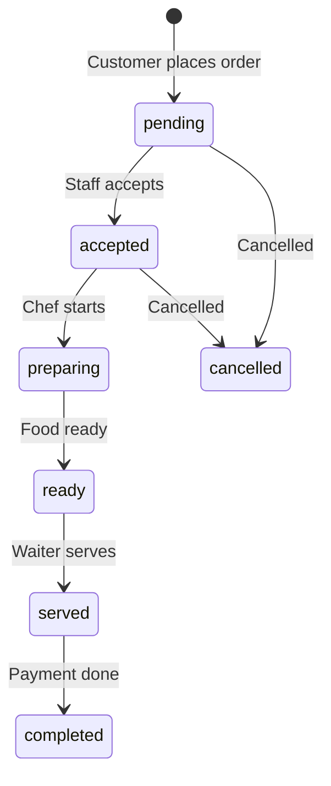

# Entity Relationship Diagram

## Visual ER Diagram (Mermaid)

```mermaid
erDiagram
    USER ||--o| EMPLOYEE : has
    USER ||--o{ FOOD : creates
    USER ||--o{ ORDER : creates
    USER ||--o{ PAYMENT : processes
    USER ||--o{ NOTIFICATION : receives

    CATEGORY ||--o{ FOOD : contains

    TABLE ||--o{ ORDER : receives
    TABLE ||--o{ RESERVATION : booked_for

    CUSTOMER ||--o{ ORDER : places
    CUSTOMER }o--o{ FOOD : favorites

    ORDER ||--o{ PAYMENT : paid_by
    ORDER }o--|| TABLE : at
    ORDER }o--o| CUSTOMER : by

    SUPPLIER ||--o{ INVENTORY : supplies

    USER {
        ObjectId _id PK
        string name
        string email UK
        string password
        enum role
        boolean isActive
    }

    FOOD {
        ObjectId _id PK
        string name
        number price
        number discount
        ObjectId category FK
        array images
        boolean isAvailable
        boolean isPopular
    }

    CATEGORY {
        ObjectId _id PK
        string name UK
        string slug UK
        boolean isActive
    }

    TABLE {
        ObjectId _id PK
        string tableNumber UK
        number capacity
        enum status
        string qrCodeUrl
    }

    ORDER {
        ObjectId _id PK
        string orderNumber UK
        enum orderType
        ObjectId table FK
        ObjectId customer FK
        array items
        number total
        enum status
        enum paymentStatus
    }

    CUSTOMER {
        ObjectId _id PK
        string name
        string phone
        number totalSpending
        number orderCount
    }

    PAYMENT {
        ObjectId _id PK
        ObjectId order FK
        number amount
        enum method
        string invoiceNumber UK
    }

    RESERVATION {
        ObjectId _id PK
        string customerName
        string phone
        number guests
        date date
        string time
        ObjectId table FK
        enum status
    }

    INVENTORY {
        ObjectId _id PK
        string name
        number quantity
        number minStock
        ObjectId supplier FK
        date expiryDate
    }

    EMPLOYEE {
        ObjectId _id PK
        ObjectId user FK UK
        string employeeId UK
        number salary
        array attendance
    }

    NOTIFICATION {
        ObjectId _id PK
        string title
        string message
        enum type
        ObjectId recipient FK
        boolean isRead
    }

    SUPPLIER {
        ObjectId _id PK
        string name
        string phone
        boolean isActive
    }

    SETTINGS {
        ObjectId _id PK
        string restaurantName
        number taxRate
        string currency
    }
```

## Order Status Flow



## User Role Access Matrix

| Feature | Super Admin | Rest. Admin | Manager | Cashier | Chef | Waiter | Customer |
|---------|:-----------:|:-----------:|:-------:|:-------:|:----:|:------:|:--------:|
| Dashboard | ✅ | ✅ | ✅ | ❌ | ❌ | ❌ | ❌ |
| POS | ✅ | ✅ | ✅ | ✅ | ❌ | ❌ | ❌ |
| Kitchen KDS | ✅ | ✅ | ✅ | ❌ | ✅ | ❌ | ❌ |
| Food CRUD | ✅ | ✅ | ✅ | ❌ | ❌ | ❌ | ❌ |
| QR Order | ❌ | ❌ | ❌ | ❌ | ❌ | ❌ | ✅ |
| Order Track | ❌ | ❌ | ❌ | ❌ | ❌ | ❌ | ✅ |
